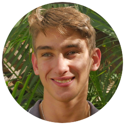

```{=html}
<div style="display: flex; align-items: center; gap: 20px;">
  
  
  <div class="text-container">
    <div class="profile-name">Antoine Malet</div>
    <div class="profile-subtitle">Ingénieur d'étude en bioinformatique</div>
  </div>
</div>
```


---


### Profil

- *Formation:*  
<u>2020-2023:</u> Licence Science de la Vie et Humanités – Université Catholique de Lyon   
<u>2023-2026:</u> Master BIMS – Université de Rouen Normandie

- *Expériences:* IE junior après 17 mois d’alternance à l’INRAE. Expérience en NGS et génomique, développement et maintenance de workflows d’analyse (Python, Snakemake) sous Linux.

- *Publications:* Concepteur du workflow **GrAuFlow** pour l’augmentation de graphes pangénome à partir de short-reads assemblés. Poster présenté lors de l'évènement **JOBIM 2025**. Disponible à l'URL: [https://hal.inrae.fr/BIOGECO/hal-05209521v1](https://hal.inrae.fr/BIOGECO/hal-05209521v1).

---

### Compétences clés

- Pangénomique & graphes
- Snakemake / Python
- Conteneurisation (Apptainer)
- Reproductibilité & Git
- SLURM & calcul distribué
- Statistiques & modélisation

---

### Contact

- 📧 antoinelm.malet@gmail.com  
- 📱 +33 07 69 85 61 40  
- 📍 Versailles, France  

[📄 Télécharger le CV en PDF](Antoine_Malet_CV.pdf)

