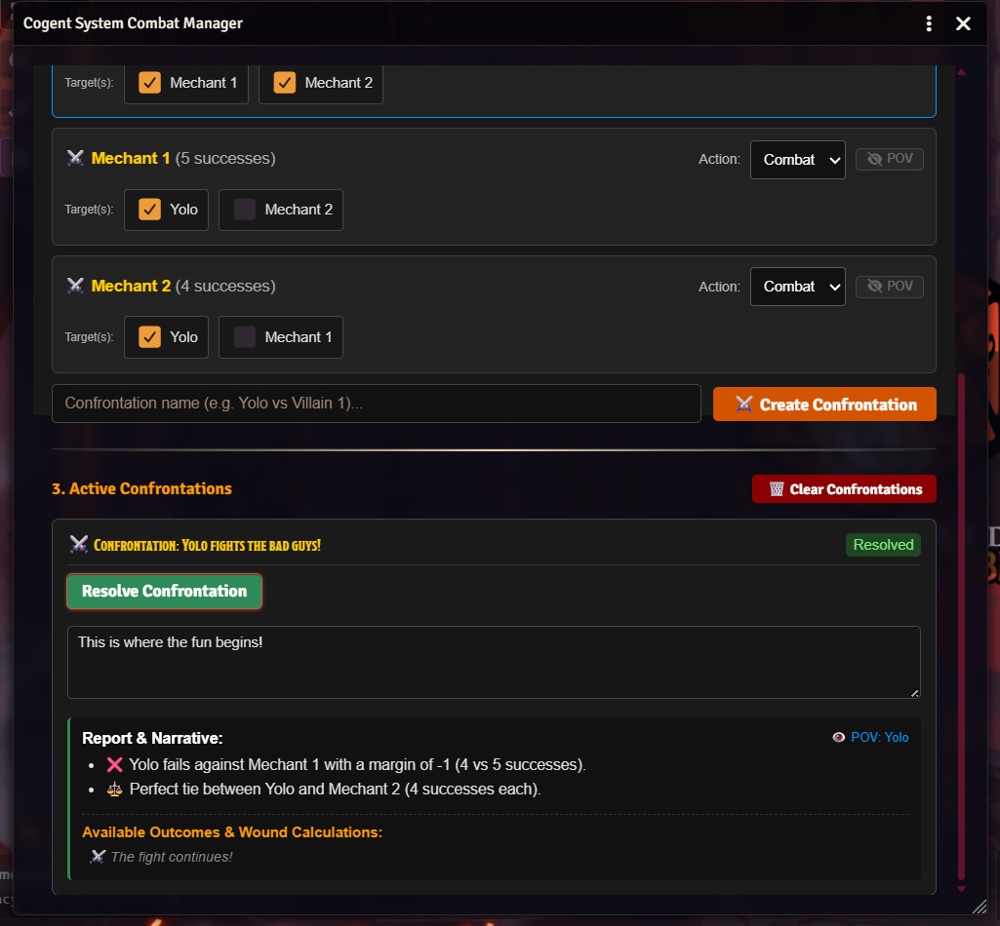

# GrAuFlow

**"Graph augmentation workflow"**: Un workflow Snakemake pour l'augmentation de graphes de pangénomes (ajout de nouvelles données génomiques à un graphe de pangénome préexistant) à partir de *short-reads* assemblés.

## Détails d'implémentation

- Développé avec Snakemake.
- Repose principalement sur la suite d'outils *vg* ("variation graphs"). Les étapes spécifiques au fonctionnement de l'outil (formatage et filtrage des données) ont été implémentées en python.
- Chaque étape est exécutée dans un conteneur adapté (Apptainer).
- Compatible avec les clusters de type SLURM.
- Paramétrable depuis un fichier de configuration YAML (config.yaml).

## Mots-clés techniques

Python  
Snakemake  
Apptainer  
Git  
Cluster SLURM  

---

[📄 Télécharger le poster en PDF](JOBIM_2025_poster_grauflow.pdf)

---

# Cogent System for FoundryVTT

**"Foundry VTT Module"**: Une extension TypeScript / JavaScript pour la plate-forme de jeu de rôle en ligne **Foundry VTT**, implémentant un nouveau système de jeu selon les règles de  [*Cogent Roleplay*](https://cogentroleplay.com/). Projet réalisé sur Git avec l'aide d'un collaborateur. Ci-dessous un exemple de l'un des modules, pour aider la résolution des combats entre personnages:

<style>
figure figcaption {
  text-align: center;
}
</style>

{width=85% fig-align="center"}

## Détails d'implémentation

- Développé en TypeScript pour l'API de Foundry VTT.
- Modélisation et automatisation de la résolution des affrontements simultanés (gestion de cibles multiples).
- Calcul dynamique des marges de réussite, échecs et égalités à partir des jetés de dés.
- Génération automatique et rendu HTML de rapports narratifs.

## Extrait de code

<details>
<summary>💻 Dérouler pour voir un exemple d'implémentation (TypeScript)</summary>

```typescript
mport { Confrontation, CombatantState, ResolvedCombatant, WoundCalculation, ModifierType } from './types';
import { T } from '../utils/translations';

export interface ConfrontationReportLine {
    actorId: string;
    opponentId: string;
    actorWins: number;
    opponentWins: number;
    victoryLevel: number;
    narrativeSummary: string;
}

export class ConfrontationEngine {
    
    // Helper to fetch actor equipment stats from Foundry Canvas Tokens
    private static getActorEquipmentData(tokenId: string) {
        // @ts-ignore
        const token = canvas.tokens?.placeables.find((t: any) => t.id === tokenId || t.document?.id === tokenId);
        const actor: any = token?.actor;
        
        if (!actor) return { armor: 0, armorBane: 0 };

        // 1. Fetch active weapon armorBane
        const weapons = actor.system?.weapons || [];
        const activeWeapon = weapons.find((w: any) => w.active === 1) || weapons[0];
        const armorBane = activeWeapon?.armorBane || 0;

        // 2. Fetch total armor defense
        const armorList = actor.system?.armor || [];
        const totalArmor = armorList.reduce((sum: number, a: any) => sum + (a.defense || 0), 0);

        if (totalArmor < 0) {
            throw new Error(T.warningNonNegativeArmor);
        }

        return { armor: totalArmor, armorBane };
    }
    public static getManeuverLabel(vl: number): string {
        if (vl >= 5) return T.vlFive;
        if (vl === 4) return T.vlFour;
        if (vl === 3) return T.vlThree;
        if (vl === 2) return T.vlTwo;
        if (vl === 1) return T.vlOne;
        return T.vlZero;
    }

    public static getInjuryLabel(il: number): string {
        if (il >= 5) return T.ilFive;
        if (il === 4) return T.ilFour;
        if (il === 3) return T.ilThree;
        if (il === 2) return T.ilTwo;
        if (il === 1) return T.ilOne;
        return T.ilZero;
    }

    public static resolveConfrontation(confrontation: Confrontation): Confrontation {
        const results: Record<string, ResolvedCombatant> = {};

        for (const [tokenId, combatant] of Object.entries(confrontation.combatants)) {
            const modifierBonus = this.getModifierBonus(combatant.modifierType);
            const baseWins = combatant.roll?.wins || 0;
            const finalWins = baseWins + modifierBonus;

            const victoryLevels = this.calculateVictoryLevels(combatant, confrontation.combatants, finalWins);
            const wounds: Record<string, WoundCalculation> = {};

            // Calculate armor & wound outcomes for each target
            const actorData = this.getActorEquipmentData(tokenId);

            for (const targetId of combatant.targetIds) {
                const vl = victoryLevels[targetId] || 0;
                
                if (vl > 0 && combatant.actionType !== 'defense') {
                    const targetData = this.getActorEquipmentData(targetId);
                    
                    const effectiveArmor = Math.max(0, targetData.armor - actorData.armorBane);
                    const maxInjuryLevel = Math.max(0, vl - effectiveArmor);

                    wounds[targetId] = {
                        targetId,
                        victoryLevel: vl,
                        defenderArmor: targetData.armor,
                        attackerArmorBane: actorData.armorBane,
                        effectiveArmor,
                        maxManeuver: this.getManeuverLabel(vl),
                        maxInjury: this.getInjuryLabel(maxInjuryLevel),
                        maxInjuryLevel
                    };
                }
            }

            results[tokenId] = {
                tokenId,
                finalWins,
                victoryLevels,
                wounds
            };
        }

        return {
            ...confrontation,
            results,
            isResolved: true
        };
    }

    public static generateReport(
        confrontation: Confrontation, 
        getTokenName: (id: string) => string = (id) => id,
        povTokenId?: string | null
    ): ConfrontationReportLine[] {
        if (!confrontation.results || !confrontation.isResolved) {
            return [];
        }

        const reportLines: ConfrontationReportLine[] = [];

        for (const [actorId, actorCombatant] of Object.entries(confrontation.combatants)) {
            if (povTokenId && actorId !== povTokenId) continue;

            const actorResult = confrontation.results[actorId];
            if (!actorResult) continue;

            const actorName = getTokenName(actorId);

            for (const opponentId of actorCombatant.targetIds) {
                const opponentResult = confrontation.results[opponentId];
                const opponentName = getTokenName(opponentId);
                const opponentCombatant = confrontation.combatants[opponentId];

                const actorWins = actorResult.finalWins;
                const opponentWins = opponentResult ? opponentResult.finalWins : 0;
                const victoryLevel = actorResult.victoryLevels[opponentId] || 0;
                const winDifference = actorWins - opponentWins;

                let narrativeSummary = '';
                const isActorDefending = actorCombatant.actionType === 'defense';
                const isOpponentDefending = opponentCombatant?.actionType === 'defense';

                if (winDifference > 0) {
                    if (isActorDefending) {
                        narrativeSummary = T.reportDefenseSuccess(actorName, opponentName, actorWins, opponentWins);
                    } else {
                        narrativeSummary = T.reportAttackSuccess(actorName, opponentName, victoryLevel, actorWins, opponentWins);
                    }
                } else if (winDifference === 0) {
                    if (isActorDefending && !isOpponentDefending) {
                        narrativeSummary = T.reportDefenseTieActor(actorName, opponentName, actorWins);
                    } else if (!isActorDefending && isOpponentDefending) {
                        narrativeSummary = T.reportDefenseTieOpponent(actorName, opponentName, actorWins);
                    } else {
                        narrativeSummary = T.reportTie(actorName, opponentName, actorWins); 
                    }
                } else {
                    narrativeSummary = T.reportFailure(actorName, opponentName, Math.abs(winDifference), actorWins, opponentWins);
                }

                reportLines.push({
                    actorId,
                    opponentId,
                    actorWins,
                    opponentWins,
                    victoryLevel,
                    narrativeSummary
                });
            }
        }

        return reportLines;
    }

    private static getModifierBonus(modifierType?: ModifierType): number {
        switch (modifierType) {
            case 'flank':
            case 'high ground':
                return 2; 
            default:
                return 0;
        }
    }

    private static calculateVictoryLevels(
        combatant: CombatantState, 
        allCombatants: Record<string, CombatantState>,
        finalWins: number
    ): Record<string, number> {
        const victoryLevels: Record<string, number> = {};

        for (const targetId of combatant.targetIds) {
            const target = allCombatants[targetId];
            const targetWins = target?.roll?.wins || 0;
            
            if (combatant.actionType === 'defense') {
                victoryLevels[targetId] = Math.min(0, finalWins - targetWins);
            } else {
                victoryLevels[targetId] = finalWins - targetWins;
            }
        }

        return victoryLevels;
    }
}
```

</details>

## Mots-clés techniques

TypeScript  
JavaScript  
Foundry VTT API  
HTML / CSS  
Développement collaboratif (Git)  
Développement assisté par IA (LLM)
